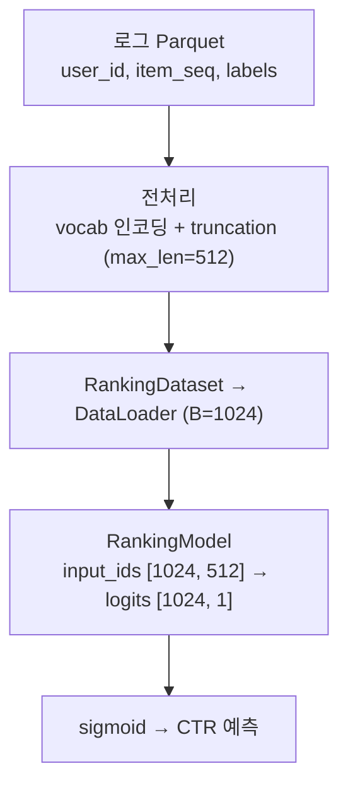
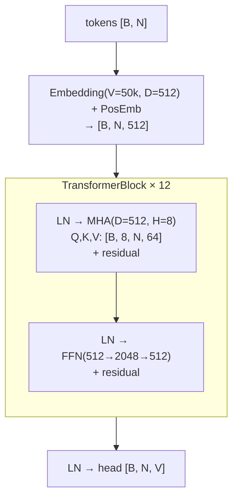
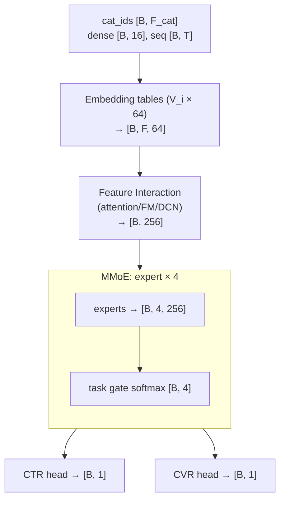
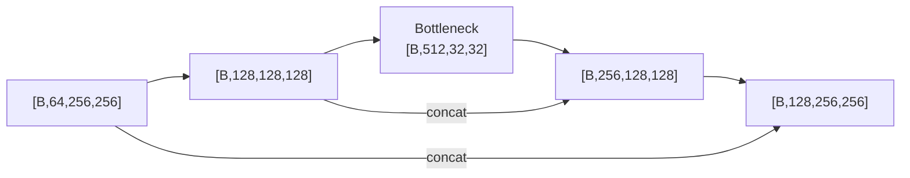

# 다이어그램 규칙

최종 문서에는 아래 다이어그램들이 반드시 포함되어야 한다.
텍스트 설명만으로는 복잡한 ML 파이프라인을 이해하기 어렵기
때문에, 다이어그램은 핵심 산출물이다.

최종 문서는 md2html 스킬로 HTML 변환되므로, HTML에서
네이티브하게 렌더링되는 형식으로 작성한다:

| 내용 | 형식 |
|------|------|
| 흐름·구조 (파이프라인, forward pass, skip 연결) | Mermaid `flowchart` |
| 형상 변환, 모델 비교 | markdown 표 |
| 디렉토리 트리, 어텐션 마스크 grid | 코드 블록 |

ASCII 박스 다이어그램은 사용하지 않는다 — HTML 변환 시
Mermaid·표보다 가독성이 떨어진다.

---

## 공통 작성 규칙

1. **형상 항상 표기**: 다이어그램 내 모든 텐서에
   `[B, N, D]` 형식으로 형상을 표기한다.
   형상 없는 블록은 불완전한 것으로 간주한다.
2. **구체적 숫자 사용**: 가능하면 config에서 읽은 실제 값을
   사용한다 (`D`가 아니라 `512`).
3. **범례 첨부**: 기호나 약어를 사용하면 반드시 범례를
   다이어그램 아래에 첨부한다.
4. **코드 참조**: 각 다이어그램 아래에 해당 코드 위치를
   링크로 첨부한다.

## Mermaid 작성 규칙

- 방향을 명시한다: `flowchart TD` 또는 `flowchart LR`.
  방향 없는 `graph`는 금지 (md2html 검증에서 걸린다).
- 노드 라벨에 `[B, N, D]` 같은 대괄호가 들어가면 라벨 전체를
  큰따옴표로 감싼다: `A["x [B, 3, 224, 224]"]`.
  감싸지 않으면 Mermaid 파싱 에러가 난다.
- 반복 블록은 `subgraph`로 묶고 라벨에 반복 횟수를 표기한다:
  `subgraph BLK["TransformerBlock × 12"]`.
- 노드 안 줄바꿈은 `<br/>`를 사용한다.

---

## D1. 엔드투엔드 파이프라인 다이어그램 (필수)

전체 시스템이 어떤 단계를 거치는지 한눈에 보여주는
최상위 흐름도. 데이터 소스부터 최종 출력까지 모든 단계를
포함한다. 각 단계에 담당 컴포넌트명과 입출력 형식을 표기한다.

예시 (CTR 랭킹 모델):


프로젝트의 아키텍처에 맞게 적응하여 작성한다.
위 예시는 하나의 형태일 뿐이다.

---

## D2. 데이터 형상 변환 표 (필수)

원시 데이터 한 샘플이 모델 입력 배치가 되기까지의 형상 변화를
markdown 표로 정리한다. 각 단계에서 형상이 어떻게 바뀌는지
명시한다.

예시 (시퀀스):

| 필드 | 원시 데이터 | Dataset 1샘플 | Batch (B=64) |
|------|------------|---------------|--------------|
| text | `"hello world"` (str) | `token_ids: [512]` int64, padded | `input_ids: [64, 512]` int64 |
| attn_mask | — | `[512]` bool | `[64, 512]` bool |
| label | `1` | `1` (int) | `labels: [64]` int64 |

예시 (추천/테이블):

| 필드 | 원시 데이터 | Dataset 1샘플 | Batch (B=1024) |
|------|------------|---------------|----------------|
| item_seq | `[1029, 583, ...]` (가변 길이) | `[512]` int64, padded | `[1024, 512]` int64 |
| dense_feat | `{age: 0.3, ...}` | `[16]` float32 | `[1024, 16]` float32 |
| label | `clicked=1` | `1.0` (float) | `labels: [1024]` float32 |

프로젝트의 데이터 타입에 맞게 작성한다.

---

## D3. 모델 Forward Pass 다이어그램 (필수)

모델 내부에서 텐서가 어떻게 흘러가는지 블록 단위로
시각화한다. 각 블록의 입력/출력 형상을 명시한다.

예시 (Transformer):


예시 (추천 멀티태스크):


- 모든 nn.Module 서브모듈의 파라미터 차원을 명시한다.
- Reshape/transpose/permute/view 지점을 반드시 표시한다.
- Skip connection, residual 경로를 명시한다.

프로젝트의 아키텍처에 맞게 적응하여 작성한다.

---

## D4. 구조 패턴 시각화 (해당 시)

아키텍처의 핵심 패턴을 시각화한다.
모든 프로젝트에 해당하는 것은 아니며, 코드에서 발견될 때
작성한다.

**어텐션 마스크** (Transformer 계열):
grid는 Mermaid로 표현할 수 없으므로 코드 블록을 유지한다.
행=Query, 열=Key로 표시하고, 기호 의미를 범례로 첨부.
```
         Pos 0  1  2  3  4
Pos 0  [  #   o  o  o  o ]
Pos 1  [  #   #  o  o  o ]
Pos 2  [  #   #  #  o  o ]
Pos 3  [  #   #  #  #  o ]
Pos 4  [  #   #  #  #  # ]
# = attend   o = masked   (causal mask)
```

**Skip Connection 경로** (ResNet, U-Net 등):
어떤 레이어가 어떤 레이어로 연결되는지 Mermaid로 시각화.


**분산 임베딩/통신 패턴** (대형 vocab 추천·랭킹 모델):
embedding table이 rank별로 샤딩되면, shard 분할과
all-reduce/all-to-all 통신 흐름을 Mermaid로 시각화한다.

**Receptive Field** (CNN 계열):
레이어별 receptive field 크기 변화를 markdown 표로 정리.

---

## D5. 모델 비교 테이블 (모델 2개 이상일 때 필수)

모델 간 핵심 차이를 한눈에 비교할 수 있는 markdown 표.
프로젝트에서 발견되는 차이점 위주로 작성한다.

예시:

| | Model A | Model B |
|---|---------|---------|
| 입력 형상 | `[B, 3, 224, 224]` | `[B, 512]` |
| 파라미터 수 | 25.6M | 3.2M |
| 핵심 블록 | ResBlock × 16 | TransformerBlock × 6 |
| 출력 형상 | `[B, 1000]` | `[B, 1]` |
| Loss | CrossEntropy | BCE |

---

## D6. 체크포인트/출력 디렉토리 구조 (필수)

디렉토리 트리는 코드 블록으로 작성한다.

```
/output/
+-- final/
|   +-- config.json
|   +-- model.pt (or model_state_dict.pt)
|   +-- optimizer.pt
+-- epoch_001/
+-- step_xxxxxx/
+-- logs/
    +-- tensorboard/
```
