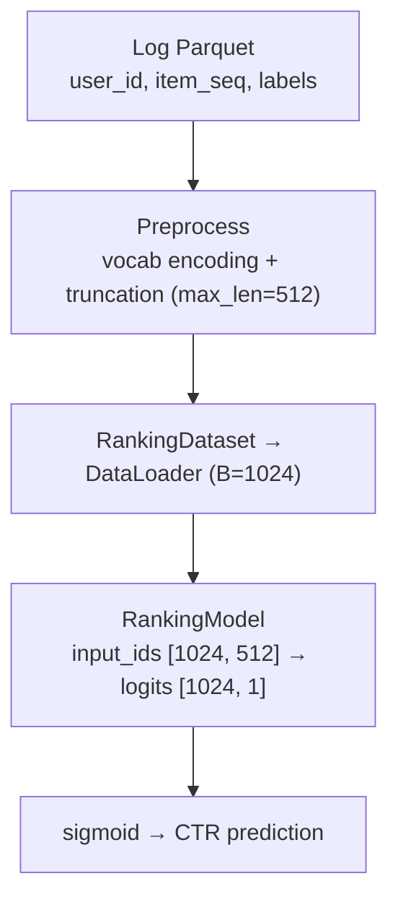
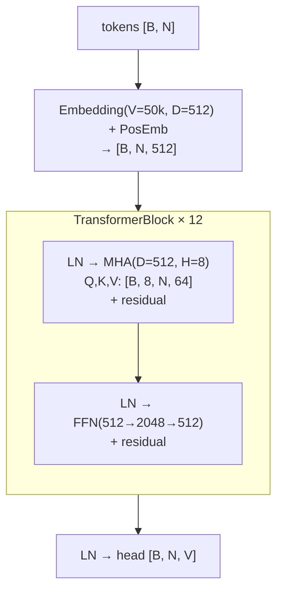
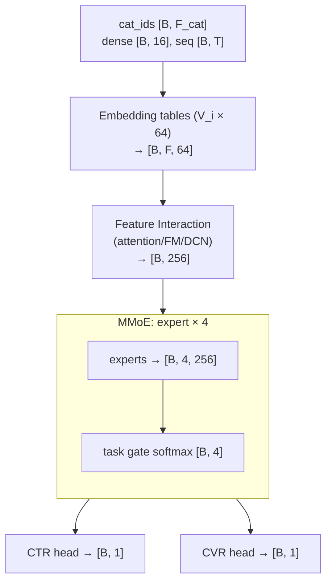
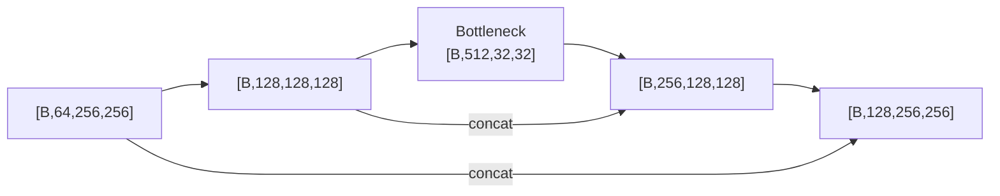

# Diagram Rules (다이어그램 규칙)

The final document must include the diagrams below. Complex ML
pipelines are hard to understand from prose alone, so the diagrams
are a core deliverable.

The final document is converted to HTML with the md2html skill, so
write in formats that render natively in HTML:

| Content | Format |
|---------|--------|
| Flow/structure (pipeline, forward pass, skip connections) | Mermaid `flowchart` |
| Shape transitions, model comparison | markdown table |
| Directory trees, attention-mask grids | code block |

Do not use ASCII box diagrams — after HTML conversion they read
worse than Mermaid and tables.

---

## Common rules

1. **Always annotate shapes**: every tensor in a diagram carries its
   shape in `[B, N, D]` form. A block without a shape is considered
   incomplete.
2. **Use concrete numbers**: prefer actual values read from the
   config (`512`, not `D`).
3. **Attach a legend**: when symbols or abbreviations are used,
   attach a legend below the diagram.
4. **Cite the code**: link the relevant code location below each
   diagram.

## Mermaid rules

- State the direction: `flowchart TD` or `flowchart LR`. A bare
  `graph` with no direction is forbidden (md2html validation rejects
  it).
- If a node label contains square brackets like `[B, N, D]`, wrap
  the whole label in double quotes: `A["x [B, 3, 224, 224]"]`.
  Without quoting, Mermaid fails to parse.
- Group repeated blocks with `subgraph` and put the repeat count in
  the label: `subgraph BLK["TransformerBlock × 12"]`.
- Use `<br/>` for line breaks inside nodes.

---

## D1. End-to-end pipeline diagram (required)

The top-level flowchart that shows at a glance which stages the
whole system passes through, from data source to final output.
Annotate each stage with the owning component and its input/output
format.

Example (CTR ranking model):


Adapt to the project's architecture — the example above is only one
shape it can take.

---

## D2. Data shape transition table (required)

Summarize, as a markdown table, how one raw sample becomes a model
input batch. State how the shape changes at each stage.

Example (sequence):

| Field | Raw data | One Dataset sample | Batch (B=64) |
|-------|----------|--------------------|--------------|
| text | `"hello world"` (str) | `token_ids: [512]` int64, padded | `input_ids: [64, 512]` int64 |
| attn_mask | — | `[512]` bool | `[64, 512]` bool |
| label | `1` | `1` (int) | `labels: [64]` int64 |

Example (recsys/tabular):

| Field | Raw data | One Dataset sample | Batch (B=1024) |
|-------|----------|--------------------|----------------|
| item_seq | `[1029, 583, ...]` (variable length) | `[512]` int64, padded | `[1024, 512]` int64 |
| dense_feat | `{age: 0.3, ...}` | `[16]` float32 | `[1024, 16]` float32 |
| label | `clicked=1` | `1.0` (float) | `labels: [1024]` float32 |

Adapt to the project's data types.

---

## D3. Model forward pass diagram (required)

Visualize how tensors flow inside the model, block by block. State
the input/output shapes of each block.

Example (Transformer):


Example (recsys multi-task):


- State the parameter dimensions of every nn.Module submodule.
- Always mark reshape/transpose/permute/view points.
- State skip connections and residual paths.

Adapt to the project's architecture.

---

## D4. Structural pattern visualization (when applicable)

Visualize the architecture's key patterns. Not every project has
them; draw them when found in the code.

**Attention mask** (Transformer family):
grids cannot be expressed in Mermaid, so keep a code block.
Rows = Query, columns = Key, with a legend for the symbols.
```
         Pos 0  1  2  3  4
Pos 0  [  #   o  o  o  o ]
Pos 1  [  #   #  o  o  o ]
Pos 2  [  #   #  #  o  o ]
Pos 3  [  #   #  #  #  o ]
Pos 4  [  #   #  #  #  # ]
# = attend   o = masked   (causal mask)
```

**Skip connection paths** (ResNet, U-Net, ...):
visualize which layer connects to which with Mermaid.


**Sharded embedding / communication patterns** (large-vocab
recsys/ranking models): when embedding tables are sharded across
ranks, visualize the shard split and the all-reduce/all-to-all
communication flow with Mermaid.

**Receptive field** (CNN family):
summarize the per-layer receptive field growth as a markdown table.

---

## D5. Model comparison table (required with 2+ models)

A markdown table that compares the key differences between models
at a glance. Focus on the differences actually found in the project.

Example:

| | Model A | Model B |
|---|---------|---------|
| Input shape | `[B, 3, 224, 224]` | `[B, 512]` |
| Parameters | 25.6M | 3.2M |
| Core block | ResBlock × 16 | TransformerBlock × 6 |
| Output shape | `[B, 1000]` | `[B, 1]` |
| Loss | CrossEntropy | BCE |

---

## D6. Checkpoint/output directory structure (required)

Write directory trees as code blocks.

```
/output/
+-- final/
|   +-- config.json
|   +-- model.pt (or model_state_dict.pt)
|   +-- optimizer.pt
+-- epoch_001/
+-- step_xxxxxx/
+-- logs/
    +-- tensorboard/
```
